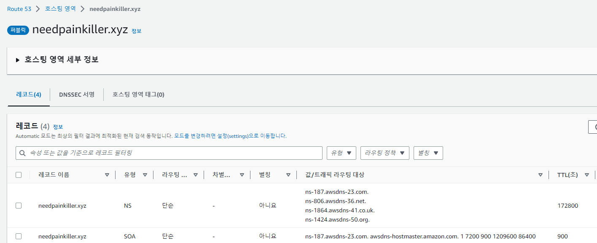
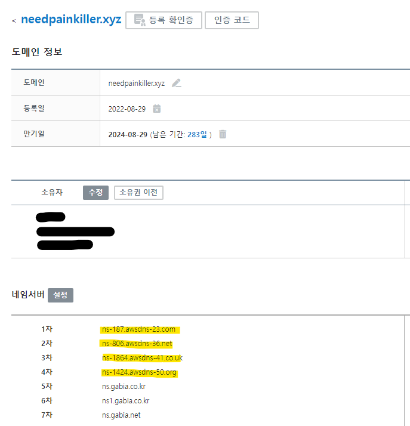
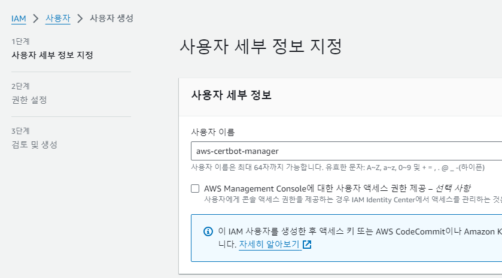
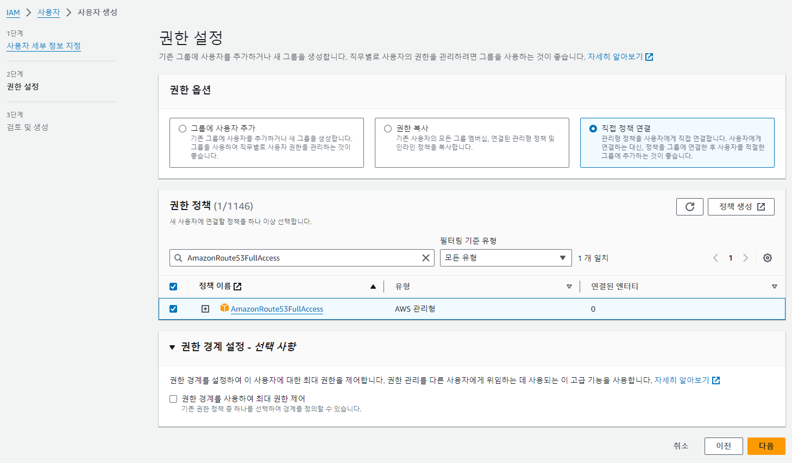
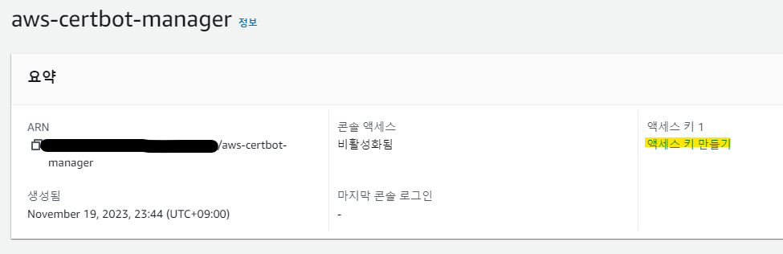
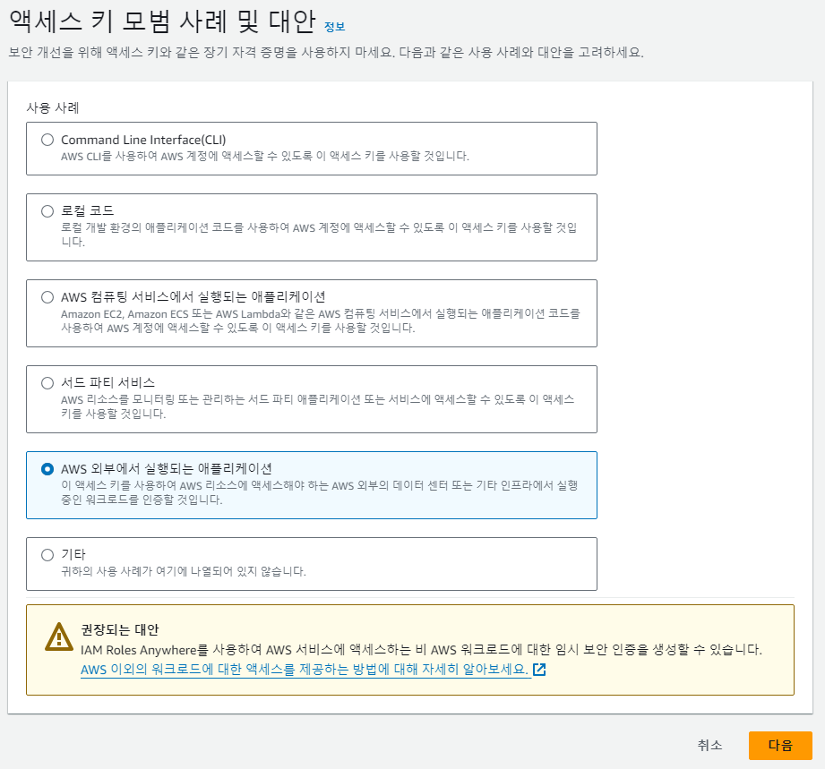
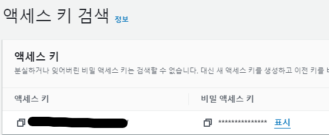

# CertBot 인증서 발급 가이드라인

## Installation & Requirements
- Docker
- 도메인 (가비아 등에서 구매)
- AWS (Route 53)

## AWS 설정
1. AWS 계정 생성
- ❗계정 생성 후 AWS IMA 에서 MFA (Multi-Factor Authentication) 등록 할 것

2. AWS Route 53 등록
- 도메인 제공업체에서 구매한 도메인 등록



3. AWS Route 53의 Nameserver 주소를 도메인 제공업체의 네임서버에 등록
- Route 53 에 명시된 "NS" 참조



4. AWS IAM 에서 Route53 에 접근 가능한 사용자 (매니저) 생성
- AmazonRoute53FullAccess 권한으로 등록




5. 매니저 AccessKey, SecretAccessKey 발급





# How to auto-renew ssl certs

Update the following infomation of `gencerts.sh` 

```
export USER=rainbow

DOMAIN=*.metabot.pro
ADMIN_EMAIL=ywkang@rbrain.co.kr

export SECRET_AWS_ROUTE53_KEY=""
export SECRET_AWS_ROUTE53_SECRET=""

```

Add a schedule into crontab

```
# Run gencerts.sh at 00:00 on every 1st day of a month
0 0 1 * * /home/kupboard/certs/gencerts.sh

# Restart Nginx at 00:10 on every 1st day of a month
10 0 1 * * /home/rainbow/nginx/nginx.sh
```
